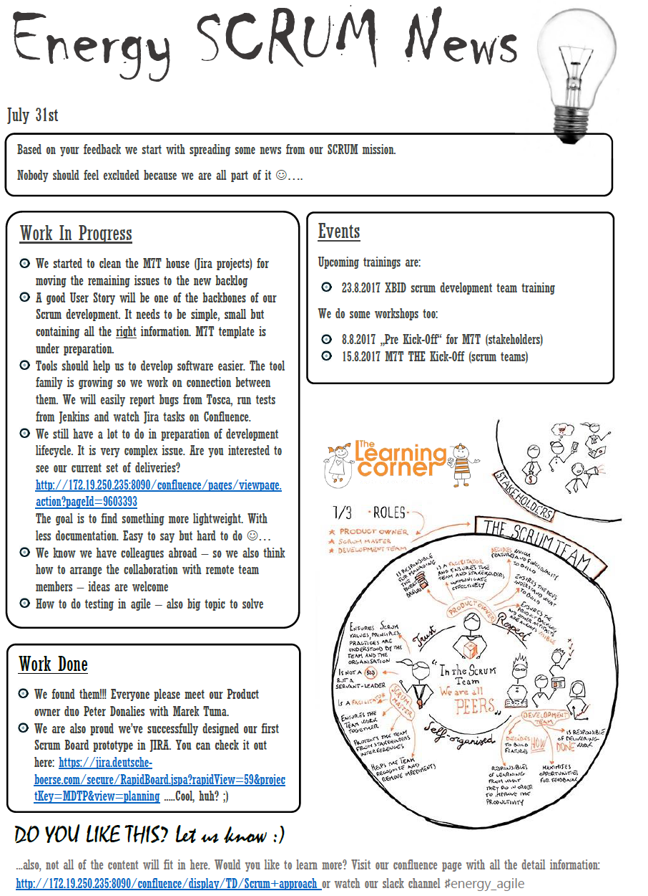
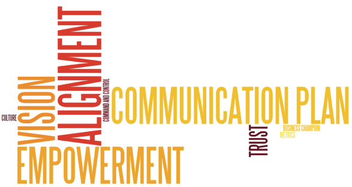
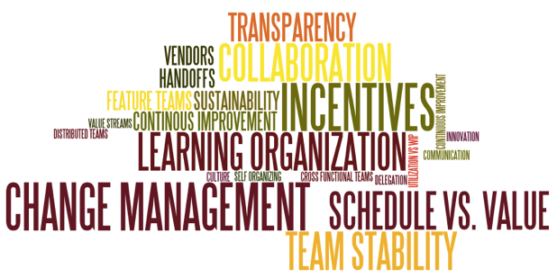
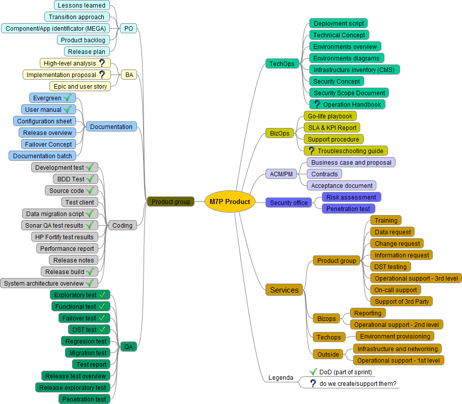
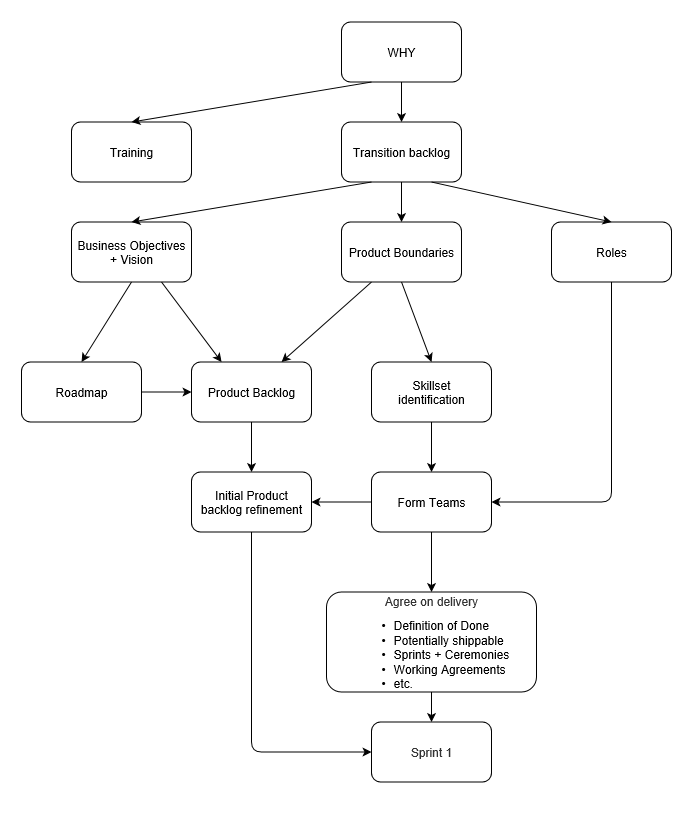
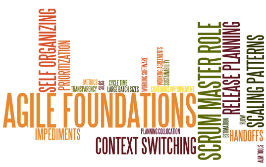
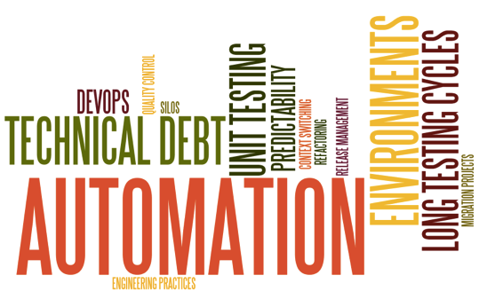

# Good
# (agile)
# transformation
---
## Why
Take aways ideas & (bad) practices

Energy section case study
<!-- .slide: data-background="./image/city-blured-2.jpg" -->

---
## What is Agile
Agile is Dead

Agile = adaptive?

Doing Agile versus being Agile

<!-- .slide: data-background="./image/city-blured-2.jpg" -->

---
## Areas of enterprise influenced by (agile) change
Level from organization to team

* Leadership
* Organization
* Product
* Delivery
* Execution
<!-- .slide: data-background="./image/city-blured-2.jpg" -->

---
## Leadership area
- WHY Agile - collaboration, satisfaction, speed…
- How to process the change
- MGMT 3.0 „information radiators“
- Transparency + safety principles
<!-- .slide: data-background="./image/city-blured-2.jpg" -->

----
### Change management methods
- „Fearless change“ by Linda Rising
- „U theory“ by Scharmer
- „Appreciative inquiry“ by Cooperrider
- „Force Field Model“ by Lewins
- Future search
- Open Space
<!-- .slide: data-background="./image/city-blured-2.jpg" -->

----
### Energy - Leadership
* Open Space
* Cofluence questionnaire
* Slack, Scrum news, whiteboards…
<!-- .slide: data-background="./image/city-blured-2.jpg" -->

----
 <!-- .element width="45%" -->

---
### Leadership insights

<small>Source:&nbsp;https://solutionsiq.com</small>
<!-- .slide: data-background="./image/city-blured-2.jpg" -->

---
## Organization area
- Transition backlog (items of Agile transition)
- Structures, policies, practices, culture
<!-- .slide: data-background="./image/city-blured-2.jpg" -->

----
### Energy - Organization
- Line structure reorganization (HoU size)
- Team targets (from individual to team view)
- Internal operation (TechOps, BizOps)
<!-- .slide: data-background="./image/city-blured-2.jpg" -->

---
### Organization insights

<small>Source:&nbsp;https://solutionsiq.com</small>
<!-- .slide: data-background="./image/city-blured-2.jpg" -->

---
## Product area
* Think about products (not projects)
* Clear product definition, boundary and vision
* Identify your development type
<!-- .slide: data-background="./image/city-blured-2.jpg" -->

----
### Product development type
- Product development
- Internal (product) development
- Project development
<!-- .slide: data-background="./image/city-blured-2.jpg" -->

Note:
* Product development - external customer or market
* Internal (product) development - one/more users in the company
* Project development - Usually for one external customer

----
### Energy - product
- Product vision - www.romanpichler.com
- Product review
- Lotus, capacity planning...
- Roadmaps in Aha!
<!-- .slide: data-background="./image/city-blured-2.jpg" -->

----
### Product artefacts
 <!-- .element height="500px" -->
<!-- .slide: data-background="./image/city-blured-2.jpg" -->

---
### Product insights

<small>Source:&nbsp;https://solutionsiq.com</small>
<!-- .slide: data-background="./image/city-blured-2.jpg" -->

---
## Delivery area
**Solid foundation of Agile values, principles and practices at team level**
- LinkedIn, Retromat, case studies, conferences…
- Finding the right scaling pattern
- Recommended fulltime Scrum Master role
<!-- .slide: data-background="./image/city-blured-2.jpg" -->

----
### Energy - delivery
- Coach engagement
- Trainings
- Using LeSS scaling framework
- Fulltime Scrum Master
<!-- .slide: data-background="./image/city-blured-2.jpg" -->

----
### Energy - practical steps
 <!-- .element height="500px" -->
<!-- .slide: data-background="./image/city-blured-2.jpg" -->

---
### Delivery insights

<small>Source:&nbsp;https://solutionsiq.com</small>
<!-- .slide: data-background="./image/city-blured-2.jpg" -->

---
## Execution area
SW engineering best practices
- Automation
- CI/CD
- Monitoring…
<!-- .slide: data-background="./image/city-blured-2.jpg" -->

----
### Energy - execution
- Documentation toolset (Markdown, Atom, ...)
- Development toolset (Sonar, Jenkins, Slack...)
- QA toolset (Cucumber, Docker, ...)
- Deployment toolset (Ansible,...)
- AWS testing environments
<!-- .slide: data-background="./image/city-blured-2.jpg" -->

---
### Execution insights

<small>Source:&nbsp;https://solutionsiq.com</small>
<!-- .slide: data-background="./image/city-blured-2.jpg" -->

---
### Q&A
<!-- .slide: data-background="./image/city-blured-2.jpg" -->

---
## Thanks!
Pavel Popelka

*pavel.popelka@deutsche-boerse.com*
<!-- .slide: data-background="./image/city-blured-2.jpg" -->
